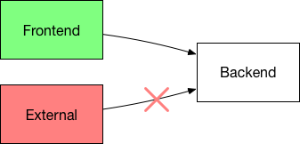

# trireme-kubernetes

[](https://twitter.com/aporeto_trireme) [](https://triremehq.slack.com/messages/general/) [](https://www.apache.org/licenses/LICENSE-2.0) [](https://godoc.org/github.com/aporeto-inc/trireme)
[](https://github.com/igrigorik/ga-beacon)


Trireme-Kubernetes is a Simple, Straightforward implementation of the NetworkPolicy API for Kubernetes. It is completely agnostic to your existing networking solution.
It is based on the [Trireme](https://github.com/aporeto-inc/trireme) Zero-Trust library

* [Kubernetes NetworkPolicy definition](https://kubernetes.io/docs/concepts/services-networking/network-policies/)
* [Declare NetworkPolicies](https://kubernetes.io/docs/tasks/administer-cluster/declare-network-policy/)

## Getting started with Trireme-Kubernetes

Trireme-Kubernetes is focused on being simple and Straightforward to deploy.

Create a PSK shared secret for Trireme-Kubernetes nodes (PKI autogeneration is coming soon):

```
wget https://raw.githubusercontent.com/aporeto-inc/trireme-kubernetes/master/deployment/createPSK.sh
./createPSK.sh
```

To install Trireme-Kubernetes as a DaemonSet on your cluster, create a serviceAccount with tailored permissions:

```
kubectl create -f https://raw.githubusercontent.com/aporeto-inc/trireme-kubernetes/master/deployment/serviceAccount.yaml
```

and deploy the DaemonSet
```
 kubectl create -f https://raw.githubusercontent.com/aporeto-inc/trireme-kubernetes/master/deployment/daemonSetPSK.yaml
```

## Getting started with policy enforcement:

You can test your setup with NetworkPolicies by using an example two-tier application: [apobeer](https://github.com/aporeto-inc/apobeer)
```
git clone https://github.com/aporeto-inc/apobeer
cd apobeer/kubernetes
kubectl create -f .
```

The deployed [NetworkPolicy](https://github.com/aporeto-inc/apobeer/blob/master/kubernetes/policy.yaml) allows traffic from `frontend` to `backend`, but not from `external` to `backend`




As a result, streaming your logs on any frontend pod should give you a stream of Beers:

```
$ kubectl logs frontend-mffv7 -n beer
The beer of the day is:  "Cantillon Blåbær Lambik"
The beer of the day is:  "Rochefort Trappistes 10"
[...]
```

And as defined by the policy, only `frontend` is able to connect. `external` logs shows that it was unable to connect to `backend`:

```
$ kubectl logs external-bww23 -n beer
```

## Kubernetes and Trireme

Kubernetes does not enforce natively those NetworkPolicies and requires a third party solution to do so. Unlike most of the traditional solutions, Trireme is not tight together with a complex networking solution. It therefore gives you the freedom to have one Networking vendor and another NetworkPolicy provider.

Trireme-kubernetes does not rely on any complex control-plane or setup (no need to plug into `etcd`) and enforcement is performed directly on every node without any shared state propagation (more info at  [Trireme ](https://github.com/aporeto-inc/trireme))


## Advanced deployment options.

Trireme-Kubernetes [can be deployed](https://github.com/aporeto-inc/trireme-kubernetes/tree/master/deployment) as:

* Fully managed by Kubernetes as a `daemonSet`. (recommended deployment)
* A standalone daemon process on each node.
* A docker container managed outside Kubernetes on each node.

## Prerequisites

* Trireme requires IPTables with access to the `Mangle` module.
* Trireme requires access to the Docker event API socket (`/var/run/docker.sock` by default)
* Trireme requires privileged access
* Trireme requires to run on the Host PID Namespace.
* When deploying with the DaemonSet model, Trireme requires access to the in-cluster service API/Token. The Namespaces/Pods/NetworkPolicies must be available as read-only
