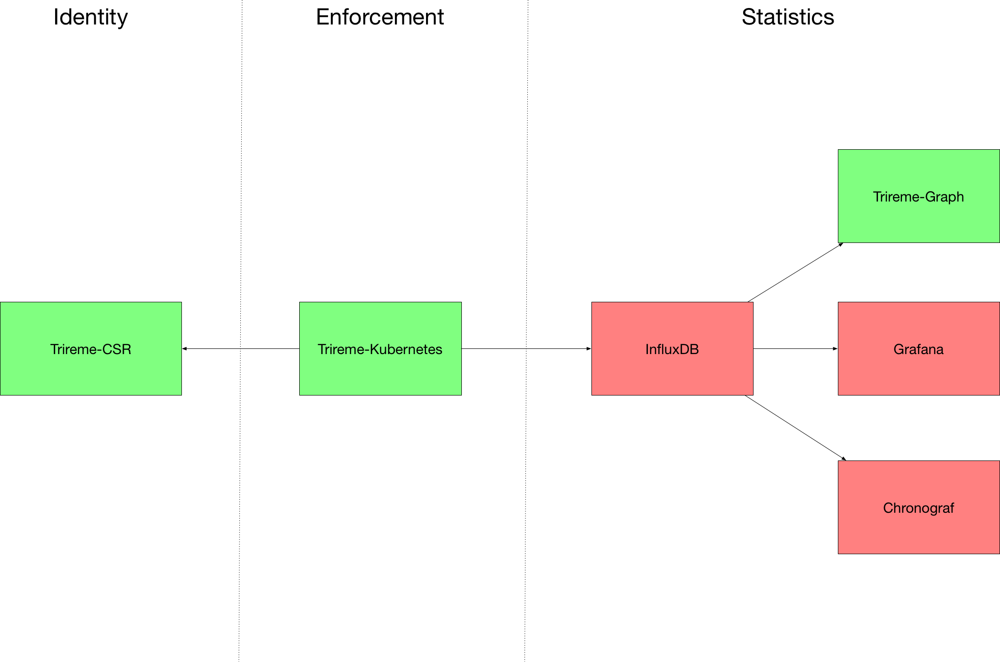

# trireme-kubernetes


[](https://twitter.com/aporeto_trireme) [](https://triremehq.slack.com/messages/general/) [](https://www.apache.org/licenses/LICENSE-2.0) [](https://godoc.org/github.com/aporeto-inc/trireme)
[](https://github.com/igrigorik/ga-beacon)


Trireme-Kubernetes is a Simple, Straightforward implementation of Kubernetes Network Policies. Unlike most of the NetworkPolicy implementations, it is completely agnostic to your existing networking solution.

It is based on the [Trireme](https://github.com/aporeto-inc/trireme) Zero-Trust library

* [Kubernetes NetworkPolicy definition](https://kubernetes.io/docs/concepts/services-networking/network-policies/)
* [Declare NetworkPolicies](https://kubernetes.io/docs/tasks/administer-cluster/declare-network-policy/)

## Trireme-Kubernetes ecosystem

Trireme-Kubernetes can be installed as a bundle with a set of optional addons:



* Trireme-Kubernetes: The enforcement service that police flows based on the NetworkPolicies defined on Kubernetes API
* [Trireme-CSR](https://github.com/aporeto-inc/trireme-csr) : An identity service that is used in order to automatically generate certificates and asymetric keypair for each Trireme-Kubernetes instance
* [Trireme-Statistics](https://github.com/aporeto-inc/trireme-statistics) bundle: Monitoring and statistics bundle that rely on InfluxDB. Flows and Container events can be displayed in either: Grafana, Chrnograf or a generated graph specifically for Kubernetes flows. Depending on your use-case, some or all of those frontend tools can be deployed.

## Getting started with Trireme-Kubernetes

Trireme-Kubernetes is focused on being simple and Straightforward to deploy.
For any serious deployment, the extensive deployment guide should be followed (That allows to )

In order to give it a quick and easy try, deploy all the YAML definition files:

Optionally, if you are using GKE or another system on which you don't have admin access (For RBAC//ABAC), make sure you can configure additional ABAC//RBAC rules:
On GKE, specifically:
```
kubectl create clusterrolebinding your-user-cluster-admin-binding --clusterrole=cluster-admin --user=your.google.cloud.email@example.org
```

1) Checkout the deployment files:
```
git clone https://github.com/aporeto-inc/trireme-kubernetes.git
cd trireme-kubernetes/deployment
```

2) create the configuration file: (keeping everything by default should be fine)
```
kubectl create -f config.yaml
```

3) Create the Statistic bundle (This will deploy all the possible options):
```
kubectl create -f statistics
```

4) Create a dummy Self-signed `Certificate Authority` for the identity service and adds it as a Kubernetes secret(requires the [tg](https://github.com/aporeto-inc/tg) utility):
```
./gen_pki_ca.sh
```

5) Create the Identity service and finally Trireme-Kubernetes:
```
kubectl create -f trireme
```

## Getting started with policy enforcement:

You can test your setup with NetworkPolicies by using an example two-tier application: [apobeer](https://github.com/aporeto-inc/apobeer)
```
git clone https://github.com/aporeto-inc/apobeer
cd apobeer/kubernetes
kubectl create -f .
```

The deployed [NetworkPolicy](https://github.com/aporeto-inc/apobeer/blob/master/kubernetes/policy.yaml) allows traffic from `frontend` to `backend`, but not from `external` to `backend`


As a result, streaming your logs on any frontend pod should give you a stream of Beers:

```
$ kubectl logs frontend-mffv7 -n beer
The beer of the day is:  "Cantillon Blåbær Lambik"
The beer of the day is:  "Rochefort Trappistes 10"
[...]
```

And as defined by the policy, only `frontend` is able to connect. `external` logs shows that it was unable to connect to `backend`:

```
$ kubectl logs external-bww23 -n beer
```

## Kubernetes and Trireme

Kubernetes does not enforce natively those NetworkPolicies and requires a third party solution to do so. Unlike most of the traditional solutions, Trireme is not tight together with a complex networking solution. It therefore gives you the freedom to have one Networking vendor and another NetworkPolicy provider.

Trireme-kubernetes does not rely on any complex control-plane or setup (no need to plug into `etcd`) and enforcement is performed directly on every node without any shared state propagation (more info at  [Trireme ](https://github.com/aporeto-inc/trireme))


## Advanced deployment and installation options.

Trireme-Kubernetes [can be deployed](https://github.com/aporeto-inc/trireme-kubernetes/tree/master/deployment) as:

* Fully managed by Kubernetes as a `daemonSet`. (recommended deployment)
* A standalone daemon process on each node.
* A docker container managed outside Kubernetes on each node.

## Prerequisites

* Trireme requires Kubernetes 1.7 for `ingress` policy only use as well as Kubernetes 1.8 for `egress` policy use.
* Trireme requires IPTables with access to the `Mangle` module.
* Trireme requires access to the Docker event API socket (`/var/run/docker.sock` by default)
* Trireme requires privileged access.
* When deploying with the DaemonSet model, Trireme requires access to the in-cluster service API/Token. The Namespaces/Pods/NetworkPolicies must be available as read-only
