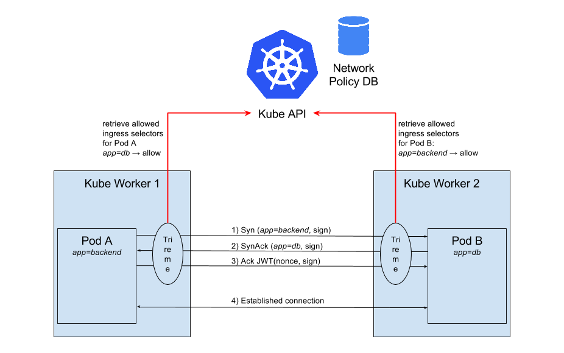

# trireme-kubernetes

[](https://twitter.com/aporeto_trireme) [](https://triremehq.slack.com/messages/general/) [](https://www.apache.org/licenses/LICENSE-2.0) [](https://godoc.org/github.com/aporeto-inc/trireme)
[](https://github.com/igrigorik/ga-beacon)

Integration with the NetworkPolicy framework from Kubernetes.
Kubernetes defines an API for NetworkPolicies. More info over here:

* http://kubernetes.io/docs/user-guide/networkpolicies/
* http://kubernetes.io/docs/api-reference/extensions/v1beta1/definitions/#_v1beta1_networkpolicy

Kubernetes does not enforce natively those NetworkPolicies and requires another library/solution to perform the actual enforcement.
The implementation of network policy with Trireme does not rely on any complex control-plane or setup. Enforcement is performed directly on every minion without any shared state (more info at  [Trireme ](https://github.com/aporeto-inc/trireme) )

Kubernetes NetworkPolicies are entirely based on `labels` and `selectors` to hide all the actual IPs for the different endpoints. Trireme is using that exact same approach. IP information is irrelevant even for enforcement. Everything is based on labels.

In order to use Trireme for Kubernetes NetworkPolicies, the only requirement is to launch the Trireme run-time on each node.



## Run-Time deployment.

That run-time can be launched as:

* A Trireme in-cluster pod by using a `daemonSet`. (recommended deployment)
* A standalone agent/daemon on the node.
* A container managed outside Kubernetes.

More details on those [options and deployment configuration](https://github.com/aporeto-inc/trireme-kubernetes/tree/master/deployment)

## Node authentication

One of the key features of Trireme is the built-in authentication scheme for different nodes belonging to the same cluster.
This cryptographic authentication ensures that every label set on a `pod` and used into the NetworkingPolicies rules is protected against man-in-the-middle type attacks.
This authentication can be based on a full Public Key infrastructure (recommended) or on a PreSharedKey.

* When using `PKI`, The PrivateKey and corresponding CA certificate must be available locally on the node. The run-time uses the Private key for signing all the labels sent on the wire. The corresponding certificate is also published as an `annotation` on the node object in Kubernetes API and can be pre-distributed through the control plane. Each node retrieves the certificate corresponding to all the other nodes by watching the node annotations. (this is optional).
* For `PreSharedKey` , the key must be available as an  environment variable. If using the `daemonSet` method for deployment, a Kubernetes secret is the safest and simplest method to share a PSK for the whole cluster.

## Try it!

Following the NetworkPolicy specifications, a namespace must be explicitly configured to use NetworkPolicies. By default, new `namespaces` are not using Network policies.
To create a new `demo` `namespace` that is using the networkpolicies:

```
kubectl create -f deployment/PolicyExample/DemoNamespace.yaml
```

Then create a typical 3 Tier policy system. Those policies replicate the typical set of permissions required for a 3-Tier model (for example, only the backend tier can open a connection to the database tier).
One policy is created for each tier, specifying exactly which set of labels are allowed to access to each tier:

```
kubectl create -f deployment/PolicyExample/Demo3TierPolicy.yaml
```

Finally, bring up a couple pods in those different tiers:

```
kubectl create -f deployment/PolicyExample/Demo3TierPods.yaml
```

Try to connect to your pods from other pods:
* External --> Backend: Forbidden
```
kubectl --namespace=demo exec -it external /bin/bash
wget http://<BACKEND_IP>
```

* Frontend --> Backend: Allowed
```
kubectl --namespace=demo exec -it frontend /bin/bash
wget http://<BACKEND_IP>
```

## Prerequisites

* Trireme requires bridged-based networking solutions for which we can redirect traffic to IPTables (Flannel, default docker networks, ...). We are working on a generic solution that allows any traffic backed by any networking vendor to always be redirected from the namespace to IPTables. We have tested with Flannel backed clusters and default Docker networking (bridged) backed clusters.
* Trireme requires IPTables with access to the `Raw` and `Mangle` modules.
* Trireme requires access to the Docker event API socket (`/var/run/docker.sock` by default)
* Trireme requires privileged access

